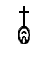
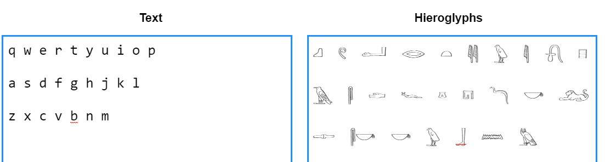
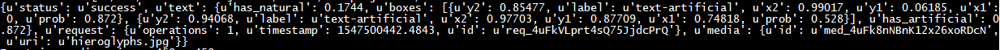
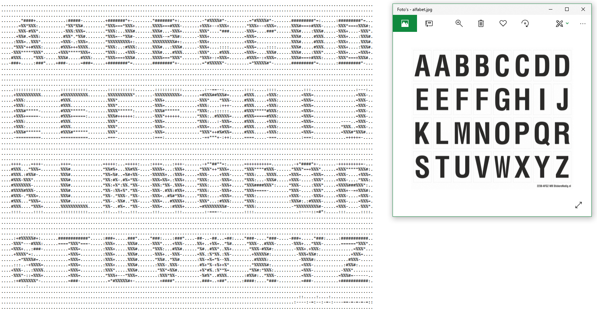
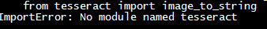
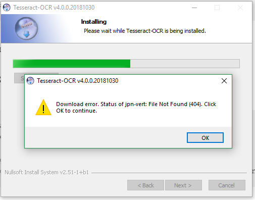
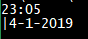
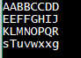
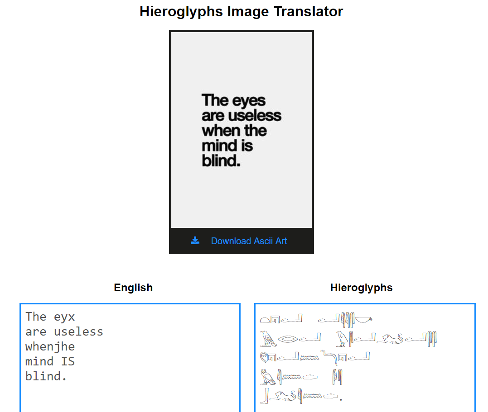
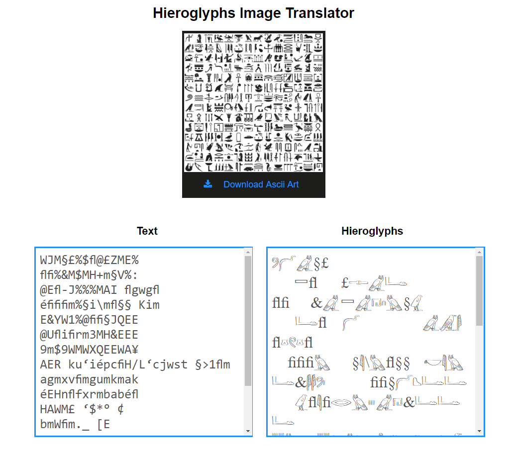

# Proof of Concept: Translate hieroglyphs through Python?


## Inhoud
- [Installation](#installation)
- [Gevolgde Stappen](#gevolgde-stappen)
   - [Site met Python en Flask](#site-met-python-en-flask)
   - [Image Uploaden](#image-uploaden)
   - [Research naar Hiërogliefen](#research-naar-hiërogliefen)
   - [Rechtstreekse Vertaling](#rechtstreekse-vertaling)
   - [Text detection op Images](#text-detection-op-images)
   - [Hiërogliefen omzetten via Ascii Art](#hiërogliefen-omzetten-via-Ascii-Art)
   - [Images omzetten naar text](#images-omzetten-naar-text)
- [Conclusie](#conclusie)
- [Resources](#resources)


## Installation

```cmd
pip install pil
 ```

```cmd
pip install numpy
 ```

```cmd
pip install pytesseract
 ```
```cmd
pip install opencv-python
 ```
- install tesseract https://github.com/tesseract-ocr/tesseract/wiki

<br>

## Gevolgde Stappen
- Site met python maken in flask
- Image uploaden
- Research naar Hiërogliefen
- Rechtstreekse Vertaling
- Text detection op Images
- Hiërogliefen omzetten via Ascii Art
- Images omzetten naar text


<br>

### Site met Python en Flask
Dit was redelijk makkelijk doordat we met web-concepten dit ook al eens gedaan hebben. Dit is gewoon een init py script aanmaken, samen met een routing script die dan de HTML templates rendered via flask. 

<br>


### Image Uploaden
Hiervoor heb ik een guide gevolgd, wat ook vrij makkelijk was. Het komt er op neer om in de routing een pagina met een POST method te hebben, waar het formulier van de HTML naar toe wordt gestuurd. In python heb je dan de volgende code:


Python:
```python
import os
from flask import Flask, render_template, request

app.config['CURRENT_FOLDER'] = os.path.dirname(os.path.realpath(__file__))
app.config['UPLOAD_FOLDER'] = '/static/uploads/'

# other routes

@app.route('/upload', methods=['POST'])
def upload_file():
	file = request.files['image']
    f = os.path.join(app.config['CURRENT_FOLDER'], app.config['UPLOAD_FOLDER'], file.filename)
    file.save(f)

    return render_template('index.html')
```

HTML:
```HTML
<form action="/upload" method="post" enctype="multipart/form-data" >
	<span class="btn btn-default btn-file">Browse <input type="file" name="image"></span>
	<input type="submit" value="Upload your image" class="btn btn-primary">
</form>
```


<br>

## Research naar Hiërogliefen
Er zijn een paar belangrijke zaken waar je op moet letten bij hiërogliefen.

Ten eerste doet deze vertaler een fonetische vertaling (of beter gezegd 'transliteration'). Hiërogliefen zijn nooit echt een officieel alfabet geweest. Er zijn ongeveer 24 verschillende symbolen die eenvoudige geluiden zijn die erg op ons alfabet lijken. Dat zijn 'unilaterals'. Er zijn ook hiërogliefen die een combinatie van letters zijn zoals 'nfr'.

<p align="center">
	
</p>


Dat betekend 'mooi', 'perfect' of 'goed'. Dit soort combinaties van letters zijn gewoon niet uit te spreken en is ook moeilijk te vertalen.
In deze vertaler worden letters dus gewoon letterlijk één voor één vervangen door de hiëroglief of andersom.

Iets anders belangrijks, spaties en leestekens bestaan eigenlijk niet in het hiërogliefensysteem, maar worden tegenwoordig wel bij onze vertalers gebruikt om toch een woorden onderscheiding te zien.

Als laatste, meestal werd er van rechts naar links gelezen, maar beide varianten komt voor. De meeste wetenschappers doen het van links naar rechts. Maar symbolen van mensen of dieren moeten altijd naar de kant kijken van waaruit gelezen wordt. Als het dus van links naar rechts is, kijken ze naar links.

<br>

## Rechtstreekse Vertaling
Ik ben dus op zoek gegaan naar een hiërogliefen font, en eigenlijk elke karakter gewoon daarin omzetten. Dat heb ik op de volgende manier gedaan.

HTML:
```HTML
<form>
	<div>
		<h2>Text</h2>
		<textarea id="textarea-en" onKeyPress="javascript:changeTxtToHG();"></textarea>
	</div>
	
	<div>
		<h2>Hieroglyphs</h2>
		<textarea id="textarea-hg" onKeyPress="javascript:changeTxtToEN();"></textarea>
	</div>
</form>

<script src="http://code.jquery.com/jquery-latest.js"></script>
```
<br>

Javascript:
```Javascript
var areaEN = document.getElementById('textarea-en');
var areaHG = document.getElementById('textarea-hg');

function changeTxtToHG(){ 
	areaHG.value = areaEN.value;
}

function changeTxtToEN(){ 
	areaEN.value = areaHG.value;
}
```
<br>
<p align="center">
	
</p>


<br>

## Text detection op Images
Nadat ik dus ook rechtstreekse vertaling heb wil ik text uit images kunnen halen. Ik heb dat geprobeerd met de API van Sightengine.

```python
#API client and key
client = SightengineClient('407400170', 'PVmF8vE3vnunnu8LQumR')

# Sightengine API call to check for txt on img
output = client.check('text').set_file(filename)
print output
```
<br>

<br>
Helaas verteld deze API alleen of er text in zit of niet, en of deze er al op zat of achteraf op is geplaatst. Verder kan je uit deze API nog dingen halen zoals weapons, hatesigns, face detection, celebrities, etc. Maar de API verteld eigenlijk alleen hoeveel dat op de foto voorkomt en niet echt welke text bijvoorbeeld.

<br>

## Hiërogliefen omzetten via Ascii Art
Ik zat er toen aan te denken om misschien de image om te zetten naar Ascii om er vervolgens iets mee te doen. Dat is als volgt gedaan:

```python
	msg = covertImageToAscii()


def getAverageBrightness(image): 
	im = np.array(image)
	w,h = im.shape
	return np.average(im.reshape(w*h))


# given image and dims (rows, cols), returns an m*n list of Images
def covertImageToAscii(cols=None, scale=None, moreLevels=None): 
	global gscale1, gscale2, filename

	# convert into greyscale
	image = PIL.Image.open(filename).convert('L')
	W, H = image.size[0], image.size[1]
	print("Input image dimensions: %d x %d" % (W, H)) 


	#set arguments
	if scale:
		scale = float(scale)
	else:
		scale = 1  # 0.43 suits Courier font
	
	if cols:
		cols = int(cols)
	else:
		cols = int(round(W/2))


	#split img into grid
	w = W/cols
	h = w/scale
	rows = int(H/h)
	print("Cols: %d, Rows: %d" % (cols, rows))
	print("Tile dims: %d x %d" % (w, h))

	#check if image size is too small 
	if cols > W or rows > H: 
		flash('Image too small for specified cols!')
		return render_template('img.html')


	####################################
	######### GENERATING ASCII #########
	####################################
	aimg = [] 
	
	for j in range(rows): #generate list of dimensions
		y1 = int(j*h) 
		y2 = int((j+1)*h) 
		
		if j == rows-1: #correct last tile
			y2 = H 
			
		aimg.append("")
		
		for i in range(cols): #crop image to tile
			x1 = int(i*w) 
			x2 = int((i+1)*w) 
			
			if i == cols-1: #correct last tile 
				x2 = W 
			
			img_crop = image.crop((x1, y1, x2, y2)) #crop image to extract tile
			
			avg = int(getAverageBrightness(img_crop)) #get average luminance
			
			if moreLevels: #look up ascii char 
				gsval = gscale1[int((avg*69)/255)] 
			else: 
				gsval = gscale2[int((avg*9)/255)] 

			aimg[j] += gsval #append ascii char to string 

	return aimg
```
<br>
Met als resultaat: 
<br><br>


Uiteindelijk kon ik hier achteraf toch niet zoveel mee doen, maar het ziet er nog wel fancy uit!


<br>

## Images omzetten naar text
Ik kwam uiteindelijk uit op Optical Character Recognition(OCR) via Pytesseract.
Bij de installatie ging het niet zo soepel. Ik probeerde eerst via de command line
```cmd
pip install pytesseract
```
en dan importen in python. Maar dat bleek niet echt te werken.
<p align="center">
	
</p>


Via de github een .exe gevonden waar ook het een en ander fout liep..
<p align="center">
	
</p>

Na flink wat omwegen en gegoogle toch kunnen installeren. Eerst heb ik het volgende geprobeerd:

```python
import pyautogui
import pytesseract
import cv2
import numpy as np
import PIL


pytesseract.pytesseract.tesseract_cmd = "C:\\Program Files (x86)\\Tesseract-OCR\\tesseract.exe"


def tesserImg(image):
	image = cv2.resize(image, (0,0), fx=2, fy=2) #double the size so letters convert properly
	ret,image = cv2.threshold(image,127,255,cv2.THRESH_BINARY) #strip colour out
	image = PIL.Image.fromarray(image, 'RGB')
	txt = pytesseract.image_to_string(image)

	return txt

def screen_grab_as_numpy_array(loc1, loc2, loc3, loc4):
	im = np.array(PIL.ImageGrab.grab(bbox=(loc1,loc2,loc3,loc4)))
	im = cv2.cvtColor(im, cv2.COLOR_BGR2RGB)
	return im

print(tesserImg(screen_grab_as_numpy_array(1812,0,1860,50)))
``` 
De lijn code met tesseract_cmd is zodat je het programma niet in je path variable moet doen.

De functie screen_grab_as_numpy_array neemt een screenshot van de locatie rechtsboven in waar de tijd staat (ik heb mijn taakbalk boven staan). Daarna wordt deze screenshot uitgelezen en omgezet in text in de tesserImg functie. Het wordt omgezet naar zwart wit en vergroot zodat er minder kans is om letters foutief te interpreteren.
<br>
<p align="center">
	<br>
</p>
<br>

Nu moet ik gewoon hetzelfde gebruiken maar dan eens op een image.
<br>
<p align="center">
	<br>
</p>
<br>

Helaas geeft de code cv2.resize en cv2.threshold een error in de website, door een memory leak. Deze heb ik nog niet weten op te lossen. Maar het uitlezen van text gaat redelijk goed nu.
<br><br>
<p align="center">
	<br>
</p>
<br>

Bij hiërogliefen gaat dit helaas iets minder goed, en ook enkel met images die vrij duidelijk zijn. Als er teveel geel in zit herkent hij niks. Toch kan hij er wel letters uit halen. Deze letter combinaties vormen dan woorden, zoals bijvoorbeeld het voorbeeld hierboven van 'nfr' dat 'mooi' betekend. Voor zover ik weet bestaan er geen packages om deze letters te ontcijferen om er echte woorden van te maken. Google Translate bijvoorbeeld zet ook gewoon de letters in een ander font, zonder iets van vertaling eraan te doen.
<br><br>
<p align="center">
	<br>
</p>

<br>

## Conclusie
Kan je met python een hiërogliefen translator maken? Deels.
De translator herkent wel letters uit de afbeeldingen, als deze duidelijk genoeg zijn, maar er is voor zo ver ik weet geen echte translator die bepaalde lettercombinaties bijvoorbeeld omzet in woorden. De manier waarop momenteel vertaald wordt is eigenlijk gewoon door ons alfabet rechtstreeks in een ander font te zetten, zonder dus rekening te houden met letter combinaties die wij niet kennen, maar wel bestaan in de hiërogliefen.


<br>

## Resources

- https://medium.com/@sightengine_/image-upload-and-moderation-with-python-and-flask-e7585f43828a

- https://www.sitepoint.com/manipulating-images-with-the-python-imaging-library/

- https://github.com/ShadyAbuKalam/Hieroglyphics-translator

- https://sightengine.com/detect-artificial-text-watermarks

- https://www.geeksforgeeks.org/converting-image-ascii-image-python/


- https://medium.com/@MicroPyramid/extract-text-with-ocr-for-all-image-types-in-python-using-pytesseract-ec3c53e5fc3a
	- https://www.youtube.com/watch?v=_5ml_Y9hqG8

- https://commons.wikimedia.org/wiki/Category:Hieroglyphs_of_Egypt_(Alphabet)

- https://nl.wikipedia.org/wiki/Egyptische_hi%C3%ABrogliefen